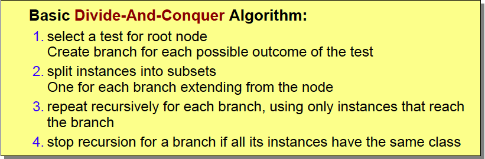
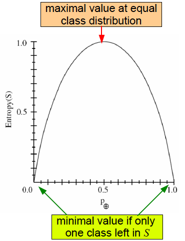
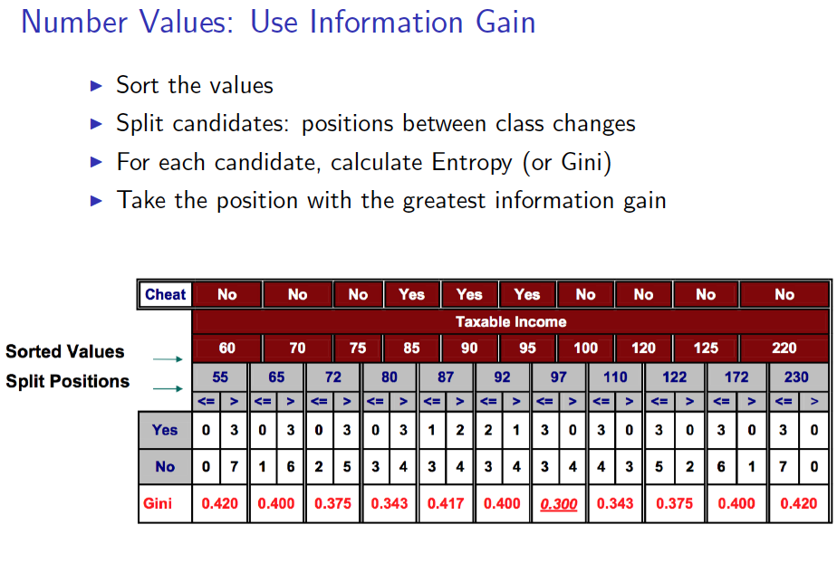
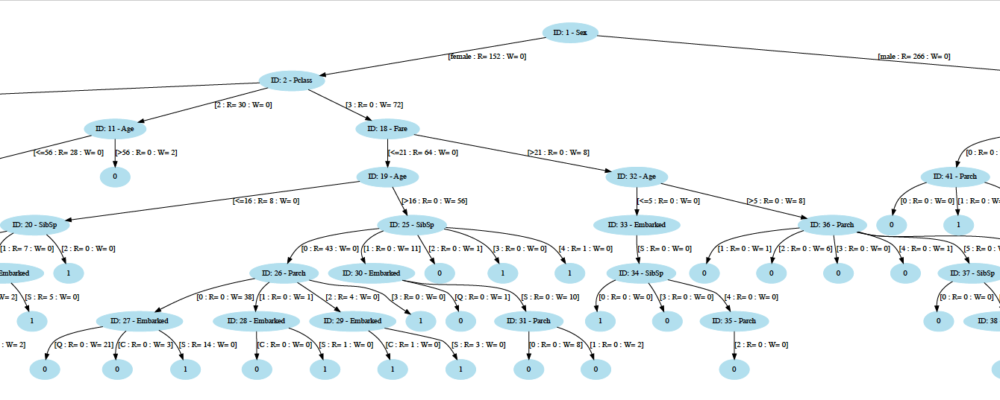
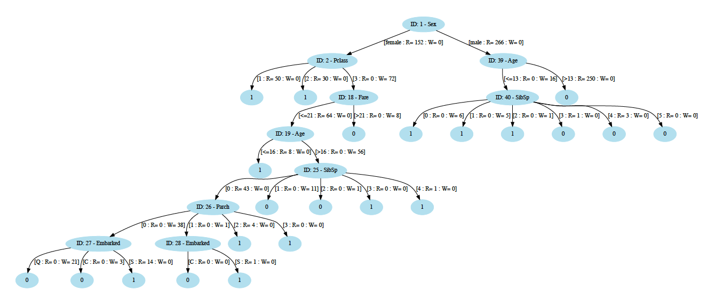

# Decision_Tree_from_scratch
- Building Decision Tree algorithm without using any pre-existing machine learning library to predict survival of Titanic passengers.
  - Here I have used **Entropy Value** of each attribute to create our decision tree.
  - The dataset used here is from **Kaggle**: [Titanic Passenger Datset Link](https://www.kaggle.com/c/titanic)
## Methods that I have used to create decision tree
### Top-Down Induction of Decision Trees:
- Learn Trees in a Top-Down Fashion
  - Divide the problem in sub problems
  - solve each problem
  
### What is a Good Attribute for a Node?
- We want to grow a simple Tree.
  - a good attribute prefers attributes that splits the data so that each successor node is as pure as possible
- In other words:
  - We want a measure that prefers attributes that have high degree of order
    - Maximum Order: All examples are of the same Class
    - Minimum Order: All Classes are equally likely
  - **Entropy** is a measure of (un-)orderedness
  - Another interpretation:
    - Entropy is the amount of information that is contained
    - All examples of the same class -> no information
    - s is a set of examples in any branch
    - p(+) is the propertion of examples in class '+'
    - p(-) is the propertion of examples in class '-'
    - p(-)=1-p(+) 
    - **Entropy** E(s) = -p(+)log2 p(+) -p(-)log2 p(-) 
    - Interpretation :
      - Amount of unorderedness in the class distribution of s
      
      - Entropy can be easily generated for classes n>2 
        - p(i) is the proportion of the examples in s that belongs to i-th class
        - E(s) = -p(1)log2 p(1) -p(2)log2 p(2) ... -p(n)log2 p(n) = -&sum;i=1n p(i)log2 p(i)
    - **Entropy** is the only function that satisfies the following 3 properties:
      - When node is pure, measure should be 0
      - When impurity is maximal (i.e. all classes are equally likely), measure should be maximal
      - Measure should obey multistage property
### For more branches of a node we compute Average entropy for the node:
- Compute the weighted average over all sets resulting from the split:
- I(s,A)= &sum;i(|si|/|s|) * E(si)
### We calculate Gain of attributes:
- Gain(s,A)= Parent_Branch_Entropy- Child_Node_Average_Entropy
### When we have a highly branching attribute like (Name or ID or some types of primary-key):
- We might face the below issues
  - Information gain might be baised towards choosing attributes with a large number of values and which can cause issues like overfitting and fragmentation.
- Inorder to deal with this issue we calculate the **intrinsic information** of attributes:
  - IntI(s,A)= -&sum;i(|si|/|s|) log (|si|/|s|) 
- Then we calculate **Gain Ratio** of attributes:
  - GR(s,A)= Gain(s,A)/IntI(s,A)
### Then we select the attribute having high Gain Ratio
### If we have continuous attributes then we can follow below steps for calculating its information gain
- All we have talked about above is for categorical attributes but what to do when we have some continuous attributes

- Then we can calculate the Gain Ratio for the continuous attribute and compare it with the rest of the attributes to decide which one should be eligible for creating a node with.
### After Executing with the above Rule and Titanic data, I got the tree something like this:
#### Honestly this tree was very big I couldn't fit it within the frame :sweat: ! but you can have a look at the full tree in the below PDF file :blush: :
- [**titanic_before_pruning.pdf**](titanic_before_pruning.pdf)

### But I did some pruning and optimization which produced more precise tree having improved accuracy :smiley::
- [**titanic_after_pruning.pdf**](titanic_after_pruning.pdf)

### Alright! So that's all the theories and logic that I have implemented in my code.
- Please have a look at the [**Decision_Tree.ipynb**](Decision_Tree.ipynb) for all the codings
- Every function and operation has comment lines included with em. Hope you will be able to understand it.
- But you can always contact me if you have any difficulties understanding the code. I'll be really happy to help you! :blush: 

##  References
- Analytical Information Systems course by **Prof. Dr. Gefei Zhang** at **Hochschule Hof**
    - [Link to Profile: **Prof. Dr. Gefei Zhang**](https://people.f4.htw-berlin.de/~zhangg/)
    - [Link to Course Description at **Hochschule Hof, Bavaria**](https://www.hof-university.com/graduate-school/masters-program-full-time/software-engineering-for-industrial-applications-meng.html)
